IDEA调试过程中设置条件：

​	在断点的红点上，点击后设置条件，然后运行。

IDEA调试过程中改变量的值：

​	在variables中可以设置变量的值，然后运行。

IDEA清除断点：

​	在调试过程中的双红点中，清除所有断点。以及下面一个功能的停用断点。

IDEA中回退断点：

​	在调试工程中的倒数第4个按钮当中。

IDEA常量名称全部都是为大写：Ctrl+Shift+U 鼠标光标点击。

IDEA设置main注入参数：

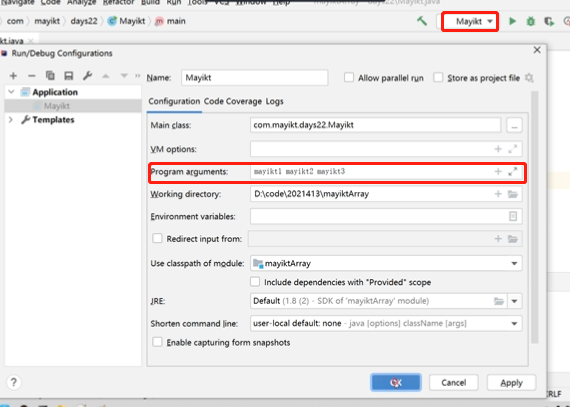

默认数据类型的默认值

整形：0

浮点：0.0

布尔false

字符：空字符

引用数据类型：null


## 基本介绍：

JavaSe：java基础知识、基础语法、面向对象的思想、集合框架、IO流、多线程、网络编程、反射等。

JavaEE：开发企业级软件系统——B/S体系架构

> 开发C/S架构的应用：
>
> swing技术开发桌面应用程序
>
> 开发B/S架构的应用：
>
> SSM、Spring企业级网站，电商类：淘宝网站、京东、支付等。

JAVA ME：在移动设备和嵌入式的设备等，安卓APP。


为什么需要Path环境变量配置？

​	可以在任意位置调用java命令，不配置则只能在bin文件夹之下。


## 1、IDEA快捷键

快速生成main方法：main和psvm回车

快速生产输出语句：sopt回车

内容辅助键：ctrl+alt+space（空格键）

注释：

> 单行注释ctrl +/
>
> 多行注释ctrl+shift+/

格式化：ctrl+alt+L


## 2、数组

1、数据初始化概念，java中的数组必须先初始化，然后才能使用；初始化就是为数组中的数组元素分配内存空间，并为每个数组元素赋值。

2、数组初始化方式：动态和静态初始化。

3、动态初始化：初始化时只指定数组长度，有系统为数组分配初始值。

4、动态初始化格式：int[] array =new int[3];

**数组内存分配**：

JDK内存空间分为：堆、栈、方法区、本地方法栈等。

```java
int[] array =new int[3];
System.out.print(array);//输出的内存地址
```

**静态初始化数组：**

```java
int[] arr =new int[]{1,2,3};
int[] arr ={1,2,3};
```


## 3、方法

方法是将具有独立功能的代码块组织成为一个整体，使其具有特殊功能的代码集。

1、方法必须先创建才可以使用，该过程成为方法定义

2、方法创建后并不是直接可以运行的，需要手动使用后才执行，该过程称为方法调用。

> 方法调用中的顺序是，先进后出，后进先出的原则。有压栈和出栈的操作。

**方法的通用格式：**

```java
public static 返回值类型 方法名(参数){
  方法体;
  return 数据;
}
```

**方法的重载：**

方法重载指同一个类中定义的多个方法之间的关系，满足下列条件的多个方法互相构成重载

1. 多个方法在同一个类中
2. 多个方法具有相同的方法名
3. 多个方法的参数类型不相同，类型不同或者数量不同。

> 多个方法参数不同，类型和数量不同。注意：和返回类型无关

**方法的传递基本类型：**形参的类型变化，不会影响到实战。（例如int）

**方法的引用类型传递：**会改变实参的数据。（数组）

## 4、Debug

F7：逐步调试

F8：过程调试

F9：进入到下一个断点


## 5、IDEA分析栈帧链

栈帧就是我们的方法，进入栈的原则是：先进后出，后进先出的原则，通过压栈和出栈。

**面向对象的基础知识：**

## 6、对象内存图

单个对象：

> new 对象名：会存储在堆内存当中。栈内存中其实存储的是变量的名称，是一个地址。student.name就是一个地址。

多个对象：

> new出一个对象，就是存储在堆中，返回给栈一个内存地址，然后在栈中通过内存地址来访问。

多个对象指向同一地址：

> 一个对象赋值给一个对象时，二个对象第内存地址是相同的。所以修改时也会改变之前对象的内容。

## 7、成员变量和局部变量的区别

成员变量：类中的方法外的变量。

局部变量：方法中的变量。

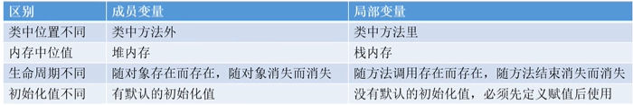

## 8、this关键字使用

this：代表所在的类对象的引用。

this的使用，避免错误。

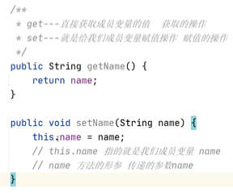

this的细节使用注意的点：

1. this关键字可以访问类中的成员属性、方法、构造函数。
2. this用于区别当前类的属性和局部变量
3. 访问成员方法的语法：this.方法名（参数列表）
4. 访问构造器语法：this(参数列表)；注意只能在构造器使用（即只能在构造器中访问另外一个构造器，必须放在第一条语句。可以有多个构造函数。
5. this不能再类定义的外部使用，只能在类定义的方法中使用。


## 9、构造方法

构造方法可以分为：无参构造方法和无参构造方法。

> 主要作用是完成对象数据的初始化。

构造方法的创建：

1. 如果没有定义构造方法，系统将给出一个默认的无参构造方法。
2. 如果定义了构造方法，系统将不再提供默认的构造方法。


5、IDEA自动生成模板类

右键生成功能，可生成构造函数和字段。


## 10、封装

​		封装：把客观事物封装成抽象的类，并且类可以把自己的数据和方法只让可信的类或者对象操作，对不可信的进行信息隐藏。

封装的规则：

1. 将类的某些信息隐藏在类的内部，不允许外部的程序直接访问。
2. 通过该类提供的方法来实现对隐藏信息的操作和访问。

封装的实现：

1. 修改属性私有（private）
2. 创建getter/setter方法（设为public用于属性的读写）
3. 在getter/setter方法中假如竖向控制语句（对属性的合法性进行判断）


## 11、继承

继承：可以使得子类具有父类的属性和方法，还可以在子类中重新定义、追加属性和方法。

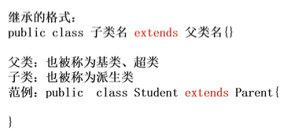

IDEA中可通过选中类名，右键图表生成类图表，可视化展示层级关系。

继承的优缺点：

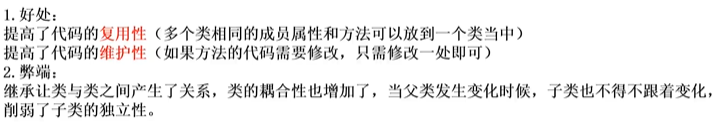


## 12、Super关键字

super和this关键字相似

1、this：代表本类对象的引用

2、super：代表父类存储空间的标识。（可以理解为父类对象的引用）

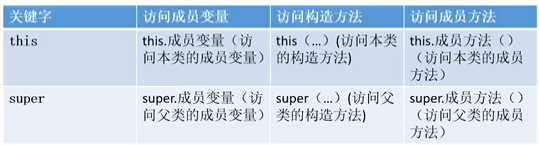

## 13、方法的重写

概述：子类中出现了和父类一模一样的方法，当子类需要父类的功能，而功能主体中，子类有自己独特的内容，就可以通过重写父类中的方法，这样即延续了父类的功能，又定义了自己特有内容。

@override是一个注解，可以帮我们检查重写方法声明的正确性。

注意：（1）私有的方法不能被重写，父类中私有方法，子类不能被继承。（2）子类方法访问权限不能比父类低（public>默认>私有的）


## 14、权限修饰符

JAVA有四种访问权限，其中三种有访问权限修饰符，分别为private，public和protected，还有一种不带任何修饰符。

1、private：Java语言中对访问权限限制的最窄的修饰符，一般称之为“私有的”。被其修饰符的类、属性以及方法只能被该类的对象访问，其子类不能访问，更不能允许跨包访问。

2、default：即不加任何访问修饰符，通常称为“默认访问模式”。该模式下，只允许在同一个包中进行访问。

3、protect：介于public和private之间的一种访问修饰符，一般称之为“保护形”。被其修饰的类、属性及其方法只能被类本身的方法及子类访问，即使子类在不同的包中也可以访问。

4、public：JAVA语言中访问最宽的修饰符，一般称之为公开的。被其修饰符的类、属性以及方法不仅可以跨类访问，而且运行跨包访问。

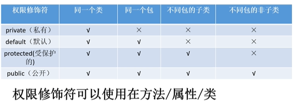


## 15、Package的作用

包其实就是文件夹。

包的作用对类实现分类管理。（类的名称+类的名称组合——保证唯一不允许重复）

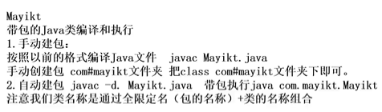

注意：在不同的包下面文件名称允许重复，相同包下面不允许重复。


## 16、导入包import

通过import的路径来引入包里面的内容。

import com.meite.m1.*; 可以通过 ※来导入所有内容。

导入包中的细节：（1）默认同一个包下面不需要导入的。


## 17、状态修饰符

### **final：最终态** 

> 可以修饰我们的类、成员属性、方法的。
>
> 1、被final关键字修饰的类无法被继承。
>
> 2、被final关键字修饰的成员方法，无法被重写的。
>
> 3、被final关键字修饰的成员属性，该变量的值（必须初始化该值）无法被修改。


final关键字修饰局部变量：

1、final关键字修饰的局部变量，是基本数据类型，该局部变量基本数据类型的值，不能够被修改的。

2、final关键字修饰的局部变量，是引用类型的，引用类型的地址，不能够被修改的，但是引用类型里面的属性值是可以发生修改的。

> 注意：引用类型的属性值赋为NULL，是不允许的。原理图如下：

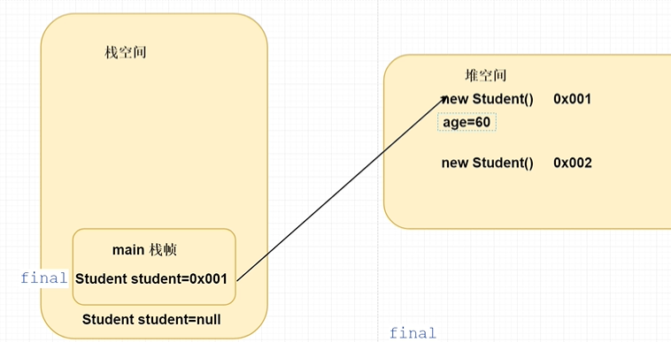


### **static：静态**

static：可以修饰成员方法、成员变量。

静态变量访问成员的特点：直接通过类名访问。

static修饰的特点：被类的所有对象**共享访问**。

> 多个实例来访问同一个变量的值，有点类似于全局变量的感觉。原理图如下：

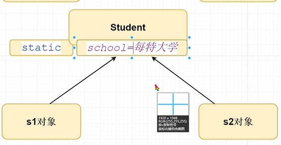


static访问特点：

非静态成员方法

1. 能够访问静态的成员变量。
2. 能够访问非静态的成员变量。
3. 能够访问静态的成员方法。
4. 能够访问非静态的成员方法。

静态的成员方法

1. 能够访问静态成员变量，但是不能够直接访问成员变量。
2. 能够访问静态的成员方法，但是不能够直接访问成员方法。


static的应用场景：

1、不想通过new的形式，访问我们成员方法和属性的。

2、java中的常量。通过final修饰变量，常量名称全部都是为大写。


## 18、main方法的细节问题

深入理解main方法：

1. main方法是java虚拟机在调用
2. java虚拟机需要调用类的main()方法，所以该方法的访问权限必须是public（因为调用的时候java虚拟机和main方法不在同一个类）
3. java虚拟机执行main方法的时候不必创建对象，所以该方法必须是static。
4. main方法接受string类型的数组参数，该数组中保存执行java命令时传递给所执行的类的参数。

注意：（1）可以直接访问本类的静态成员（2）访问本类的非静态成员，需要先创建对象，再调用即可。


## 19、多态

多态的概述：同一个对象，在不同的时刻表现出来的不同形态。

例子如图：

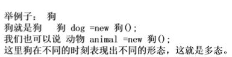

多态的前提和体现（基本的条件）：

1. 有继承/实现关系。
2. 方法重写。
3. 有父类引用指向子类对象。


多态的访问特点：

成员属性——编译看左边，执行看左边。

成员方法——编译看左边，执行看右边。

> 为什么成员变量和成员方法的访问不一样呢？因为成员方法有重写、而成员变量是没有的。


多态的好处与缺点：

多态机制的优点——（1）提高程序的扩展性（如下图的方法调用）

多态机制的缺点——（1）不能使用子类的特有功能

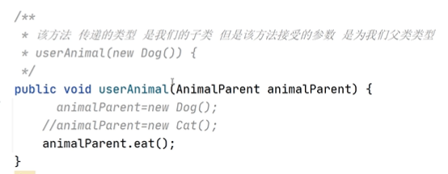


多态中的转型：

1、向上转型（多态机制）

> 从子到父，父类引用指向子类对象

2、向下转型

> 从父到子（转换过程中可能出现异常），父类引用转为子类对象

向上转型和向下转型的案例=>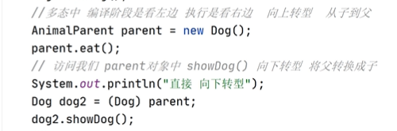

多态中的转型的图解=>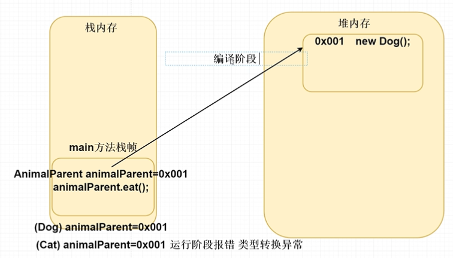


## 20、抽象类

概念：一个没有方法体的方法应该定义为抽象方法，而类中如果有抽象方法，该类必须定义为抽象类。

抽象类和抽象方法用abstract关键字来修饰。

> 抽象类：abstract calss 类名{}
>
> 抽象方法：pubilc abstract void eat();//抽象方法中没有方法体

抽象案例的图解=>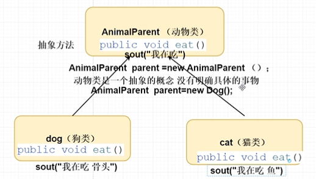


**抽象类的特点：**

1. 抽象类中不一定有抽象方法，但是有抽象方法的类必须为抽象类。

2. 抽象类不能实例化。

3. 抽象类由具体的子类进行实例化。

4. 子类必须对父类（抽象类）中的所有抽象方法进行重写。

5. 在抽象类中可以定义非抽象方法。

6. 子类如果不重写抽象类中的抽象方法，则该类还是抽象类。

7. 抽象类中可以有构造方法，用于子类访问父类时的数据初始化。

   > 1、在抽象类和子类继承的情况下，new 子类对象时（传递值的时候），默认先执行父类的无参构造函数，在执行到子类的有参构造方法（子类默认执行了super方法）。
>
   > 2、在子类初始化的过程中（传值），可以通过子类调用super来初始化父类数据。

   

   画图分析抽象类和继承类的案例分析：

   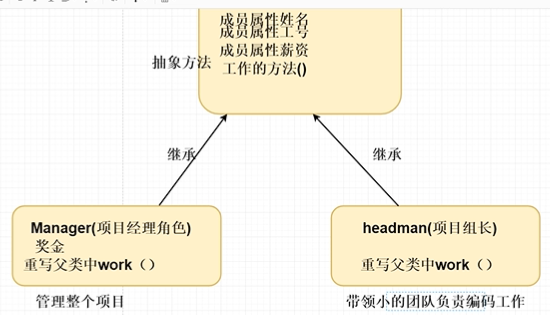

   

   **abstract抽象关键字不能和什么关键字使用呢？？？**

   1. private关键字，abstract的方法必须被子类重写，而private不能被继承。
   2. final关键字，final修饰的方法，变量都不能修改，而abstract修饰的方法必须重写。
   3. static关键字，不能共存，无意义，static是静态的，abstract方法中无方法体，无法调用。

   

   ## 21、接口

接口：一种公共的规范标准，只要符合规范标准，大家都可以通用。

> JAVA中的接口更多的体现在对行为的抽象！

**接口的特点：**

1. 接口用关键字interface修饰

   > public interface 接口名{}

2. 类实现接口用implements表示

   > public class 类 implements 接口{}

3. 接口不能够实例化

   > 接口如何实例化呢？参照多态的方式，通过实现类对象实例化，这叫接口多态。

4. 多态的前提：有继承或者实现关系；有方法重写；有父（类/接口引用）指向（子/实现）类对象。

5. 接口的实现类，要么重写接口中所有的抽象方法、要么是抽象类。


**接口中成员变量访问特点：**

1、成员变量只能是常量

> 默认修饰符 Public static final

2、成员方法只能是抽象方法（JDK8开始，是可以在接口中定义非抽象方法，是需要加上default关键字修饰的）

> 默认修饰符 pubilc abstract 

3、接口没有构造方法

> 因为接口主要对行为进行抽象，没有具体存在，一个类如果没有父类，默认继承自Object类。


**类和接口的区别：**

1、类和类的继承关系（一个类只能够单继承一个父类，不能够多继承n多个不同的父类）

> 继承关系，只能单继承，但是可以多层继承

2、类和接口的实现关系（一个类可以实现n多个不同的接口）

> 实现关系，可以但实现，也可以多实现，还可以在继承一个类的同时实现多个接口。

3、接口和接口继承的关系（一个接口是可以继承n多个不同的接口的）

> 继承关系，可以单继承，也可以多继承

**抽象类和接口的区别：**

1、成员区别：

​	1.1 抽象类、变量、常量、有构造函数；有抽象方法，也有非抽象方法

​	1.2 接口常量，抽象方法（JDK8在接口中定义非抽象方法）

2、关系区别：

​	2.1 类与类 继承单继承

​	2.2 类与接口 实现，但实现和多实现

​	2.3 接口与接口 继承，单继承和多继承

3、设计区别

​	3.1 抽象类 对类抽象，包括属性行为（对事物的抽象）

​	3.2 接口 对行为抽象，主要是行为（对行为的抽象）


## 22、内部类

概念：就是在一个类中定义一个类，就是为内部类。

比如：在一个类A的内部定义一个类B，类B就被称为内部类，类A相应地成为外部类。

内部类的定义格式：

```java
public class MayiktA{//外部类
  public class MayiktB{//内部类
    
  }
}
```

内部类的访问特点：

1. 内部类可以直接访问外部类的成员，包括私有。
2. 外部类要访问内部类的成员，必须创建对象。


内部类的分类：

成员内部类：（静态内部类、成员内部类）

局部内部类：（方法内部类、匿名内部类）


成员内部类和局部内部类的区别：

1、如果类定义在方法里面，该类就是为方法内部类或者是局部内部类。

2、如果类定义在方法外面，该类就是为成员内部类，如果加上了static静态修饰，则该类是为静态内部类。

> 


外界访问内部类的方式：

​		在实际开发中是不会这样使用的。因为一般内部类就是不让外界直接访问的。

​		成员内部的常见修饰符 private 为了保证数据的安全性。

```java
public class MayiktA{//外部类
  public class MayiktB{//内部类
    public void mayiktB(){
      //方法内容
    }
  }
}
//MayiktA为外部类，MayiktB为内部类
MayiktA.MayiktB mayiktB =new MayiktA().new MayiktB();
mayiktB.mayiktB(();
```


**静态内部类：**

访问方式：外界如果访问静态内部类new 外部类.内部类()来访问就行。

> MayiktA.MayiktB mayiktB = new MayiktA.MayiktB();

访问条件：

1、有static关键字修饰的内部类为静态内部类。

2、静态内部类访问外部类的静态成员变量或方法必须是静态的。


**局部内部类：**

定义：在方法里面定义的内部类就是局部内部类（方法内部类）

​		局部内部类是在方法中定义的类，所以外界是无法直接使用，需要在方法内部创建对象并使用该类可以直接访问外部类的成员，也可以访问方法内部的局部变量。

```java
//局部内部类
public void mayikt(){
   class MayiktB{
     public void mayiktB(){
       System.out.println("局部内部类mayiktB")
     }
   }
  MayiktB mayiktB= new MayiktB();
  mayiktB.mayiktB();
}
```


**匿名内部类：**

使用我们的匿名内部类，就不需要创建我们的实现类和子类呢。

直接通过new 内部类的形式，简化不需要创建实现类和子类呢。

调用：

> 下方为接口的直接通过匿名内部类重写调用，抽象类也是一样可以的。

```java
public static void main(String[] args){
  MayiktB mayiktB =  new MayiktB(){ //MayiktB为接口
      @override
      public void mayiktB(){
        //匿名内部类方法
      }
  }
  mayiktB.mayiktB();
  
}
```

  

**匿名内部类开发中使用场景：**

匿名内部类开发中的使用场景是，使用匿名类，可以不用创建我们的实现类。

**匿名内部类原理：**

Java编译阶段，在底层会创建一个没有名称的实现类（null）继承，然后实现我们的接口或者抽象类。

例如：


