# 常见API和异常

## 1、API

指的就是JDK中提供的各种功能的JAVA类，这些类将底层的实现封装了起来，我们不需要关心这些类是如何实现的，只需要学习这些类如何使用即可，我们可以通过帮助文档来学习这些。

例如：随机数生成

```java
Random random =new Random();
int i =random.nextInt(101)//0-100
```

JDK官方提供的类库，都是在rt.jar包下。

例如：

```java
Scanner sc = new Scanner(System.in);
int i = sc.nextInt();
System.out.println(i);        
```


## 2、Object类

Object类有哪些方法：

1、有一个无参构造方法，默认继承的都会调这个方法。

2、clone()——克隆方法（复制对象）

3、equals(object obj)—— 比较二个对象是否相等

4、finalize() ——jvm的垃圾回收机制。

5、getclass()——获取该对象的class

6、hashcode()——hashmap集合

7、notify()、notifyall()、wait()、wait(long timeoutMillis)

8、tostring()方法——返回对象的字符串形式


## 3、控制台输出对象原理

对对象实例输出的底层原理。

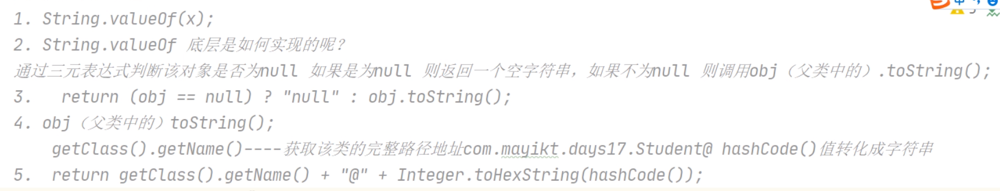


## 4、重写Tostring

在类中，重写tostring方法时，输出对象时，就会调用重写的方法，来输出类的属性值。


## 5、String字符串

我们的char只能够保存单个字符，String保存多个字符——保存字符串。

 JDK8的String数组底层是基于char[]实现的，JDK9底层是基于byte[]存放。


**String字符串原理：**

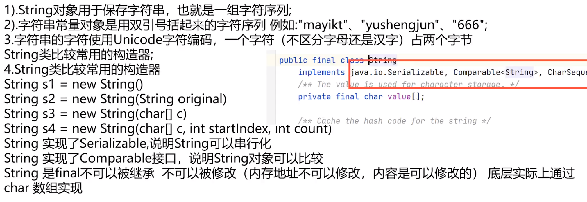


## 6、String类的equals方法

equals方法——比较二个字符串的值是否相等。

> equals比较时，前者比较的对象为Null时，则会报错。

源码解读：

String类中的equals重写我们Object类父类中的equals比较二个字符串值是否相同。

String类重写了equals的方法，如下：

```java
    public boolean equals(Object anObject) {
      	//判断地址是否相同
        if (this == anObject) {
            return true;
        }
       	//判断比较类型，是否，是为String
        if (anObject instanceof String) {
          	//该类型强转为String类型
            String anotherString = (String)anObject;
            int n = value.length;
            if (n == anotherString.value.length) {
                char v1[] = value;
                char v2[] = anotherString.value;
                int i = 0;
                while (n-- != 0) {
                    if (v1[i] != v2[i])
                        return false;
                    i++;
                }
                return true;
            }
        }
        return false;
    }
```


## 7、object中的equals方法

==比较二个对象的内存地址是否相同。

equals比较二个对象值是否相同。

> 1、Object中的equals方法时直接判断this和obj本身的值是否相等。
>
> 2、可以重写父类中的equals方法比较二个对象成员属性值是否相同。

条件：如果自定义的对象没有重写object父类的话，则是在比较二个对象的内存地址是否相同。

重写自定义对象中的equals方法，如下代码：

```java
    public boolean equals(Object s2) {
        //判断地址是否相同
        if (this == s2) {
            return true;
        }
        //1、判断s2是否为Null
        //2、判断类型是否相同
        if (s2 == null || this.getClass() != s2.getClass()) {
            return false;
        }
        Student stu =(Student)s2;
        return this.age==stu.age;
    }
```

 

## 8、instanceof关键字

  		instanceof通过返回一个布尔值来指出，某个对象是否是某个特定类或者是该特定类的子类的一个实例。

1、如果object是calss的一个实例，则instanceof运算符返回true。如果object不是指定类的一个实例，或者object是null，则返回false。class可以使类，可以是接口。

2、instanceof在Java的编译状态和运行状态是有区别的：

2.1 在编译状态中，calss可以使object对象的父类，自身类，子类。在这三种情况下Java编译时不会报错。

2.2 在运行状态中，class可以是object对象的父类，自身类，**不能是子类**。在前二种情况下result的结果为true，最后一种为false。但是class为子类时编译不会报错。运行结果为false。（大致就是判断表达式：class 变量=(class)object的引用 是否成立）


## 9、String替换方法

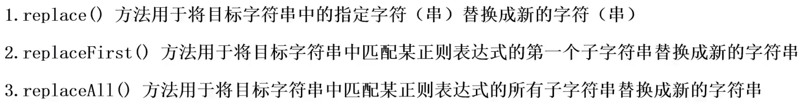


## 10、分隔Split()用法

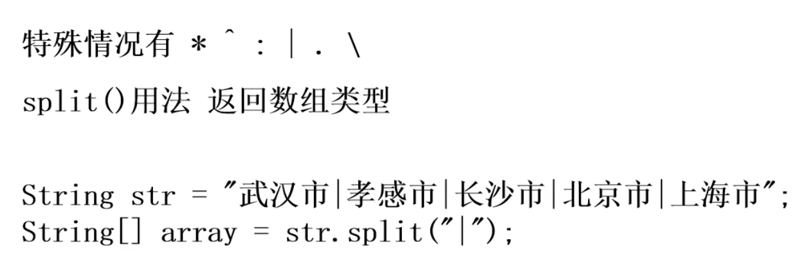


## 11、ASCII码字符对照表

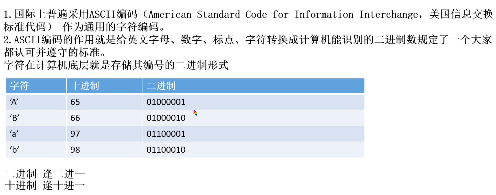

## 12、IndexOf

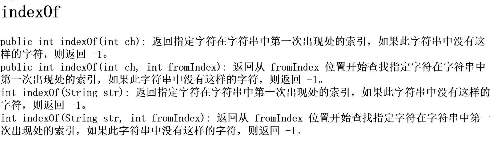


## 13、JDK9为什么要将字符串的char数组更改为byte数组

节省String占用JVM的内存空间。


## 14、JVM元空间

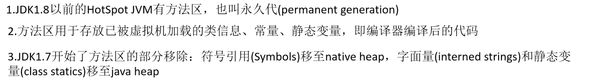


## 15、Math类

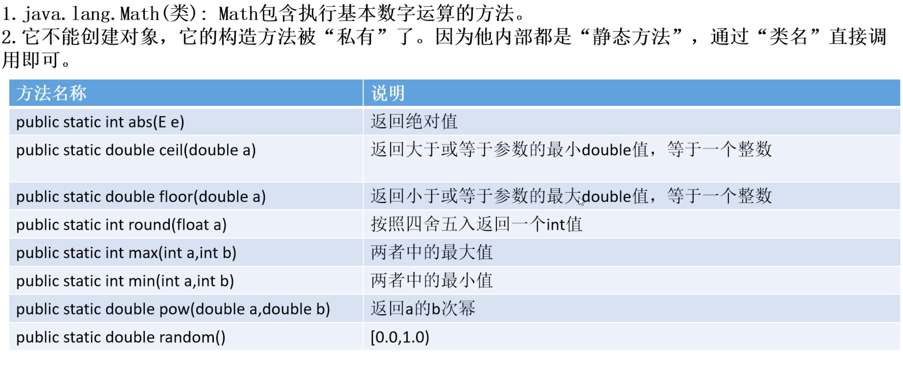


## 16、Sytem类

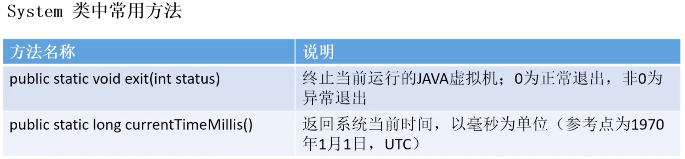


## 17、Arrays类常用方法

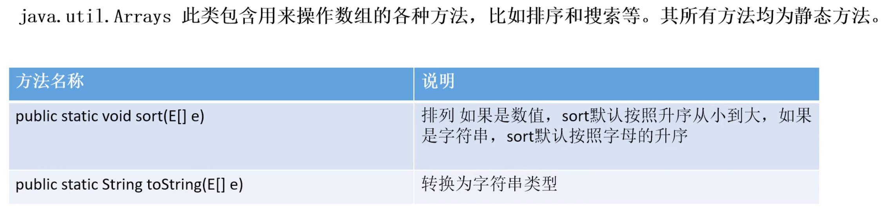


## 18、包装类概念

JAVA中基本数据类型：四种整数类型（Byte、short、int、long）、二种浮点数类型（float、double）、一种字符类型（char）、布尔类型（boolean）。

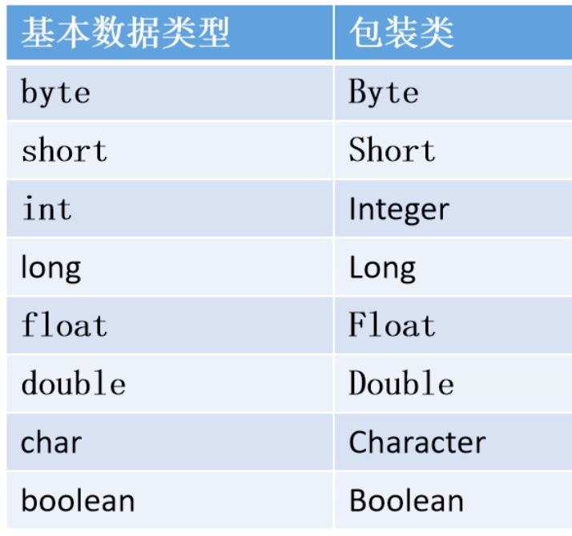

## 19、int和String的相互转换

基本类型包装类最常见的操作就是：用于基本类型和字符串之间的转换。

int转换为string：public static valueOf(int i)——返回int参数的字符串表示形式。该方法是string类中的方法。

String转换为int：public static parseint(string s)——将字符串解析为int类型，该方法是integer类中的方法。

string转Long：

```java
String s ="123321";
Long aLong =Long.valueOf(s);
long l1 =aLong.longValue();//longValue返回基本数据类型
System.out.println(l1);
//或者
long parseLong = Long.parseLong(s);
```

## 20、基本数据类型和包装类型的区别

1、包装类是对象，拥有方法和字段，对象的调用都是通过引用对象的地址；基本类型不是。

2、声明方式不同：

​			基本数据类型不需要new关键字

​			包装类型需要new在堆内存中进行new来分配内存空间

3、存储位置不同：

​			基本数据类型直接将值保存在值栈中；

​			包装类型是把对象放在堆中，然后通过对象的引用来调用他们。

4、初始值不同：

​			int的初始值为0、boolean的初始值为false

​			包装类型的初始值为null。

5、包装类型是引用的传递；基本类型是值的传递。


## 21、装箱和拆箱

装箱：自动将基本数据类型转换为包装器类型。

拆箱：自动将包装器类型转换为基本数据类型。


```java
Integer i =5;//装箱
int j=i;//拆箱
//在装箱的时候自动调用的是Integer的valueOf(int)方法
//而在拆箱的时候自动调用的是Integer的intValue方法
Integer z =5;
z+=1;
//请问该它装箱和拆箱的流程是？
z+1==自动拆箱 z=z+1;自动装箱
```


## 22、字符串中的数据排序


## 23、Data日期

Date代表了一个特定的时间，精确到毫秒。

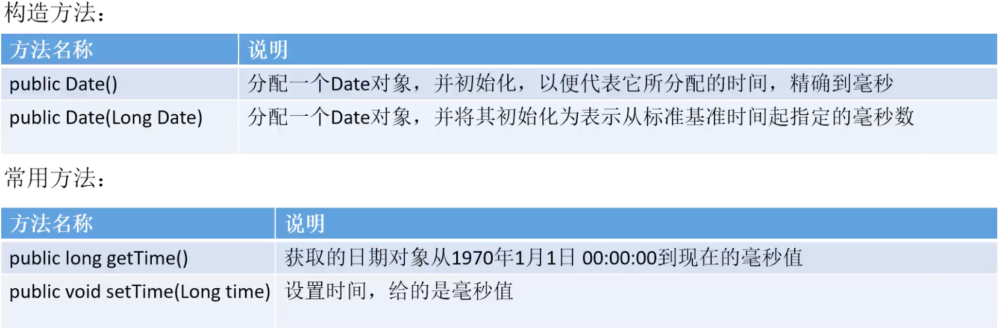 

## 24、SimpleDateFormat格式

SimpleDateFormat是用于以区域设置敏感的方式格式化和解析日期，它允许格式化（日期文本），解析（文本日期）。

1、对时间日期进行格式化处理。

2、把Date对象转化为年月日时分秒格式字符串。

3、把字符串转化为Date对象

常用的模式字母及对应关系如下：

y 年 、M 月、 d 日、 h 时 在上午或下午（1-12）、H 时 在一天中（0-23）、m 分、s 秒。

例如：

```java
Date date =new Date();
SimpleDateFromat simpledatefromat = new SimpleDateFormat("yyyy年MM月dd日HH小时mm分ss秒");
String sDate =simpledatefromat.format(date);
```


将Date字符串转化为Date：

```java
String s = "2021-10-22 04:39:30";
SimpleDateFromat simpledatefromat = new SimpleDateFormat("yyyy-MM-dd HH:mm:ss");
Date date =simpledatefromat.parse(s);
```


## 25、异常

1、异常：就是程序执行报错或者出现了不正常现象。

2、如果程序出现了问题，我们没有做任何处理，jvm最终会默认处理，将异常的名称，异常的原因及异常出现的位置等信息输出再控制台。

处理异常：

1、try...catch...

执行流程：

程序从try里面的代码开始执行

出现异常，会自动生成一个异常类对象，该异常对象将被提交给java运行时系统

当java运行时系统接受到异常对象时，会到catch中去找匹配的异常类，找到后进行异常的处理。

执行完毕之后，程序还可以继续往下执行。


## 26、Exception

所有的异常的父类

catch的执行顺序

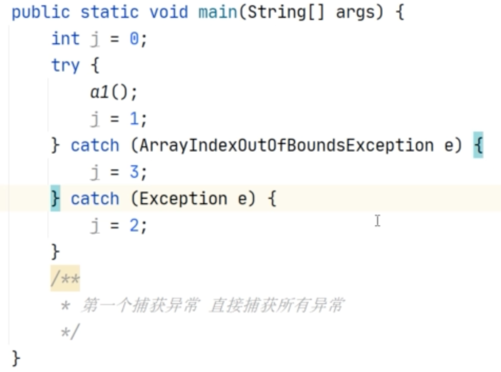


## 27、throwable的成员方法

public string getmessage 返回此throwable的详细消息字符串

Public string tostring 返回此可抛出的简短描述

public void printstacktrace() 把异常的错误信息输出在控制台


