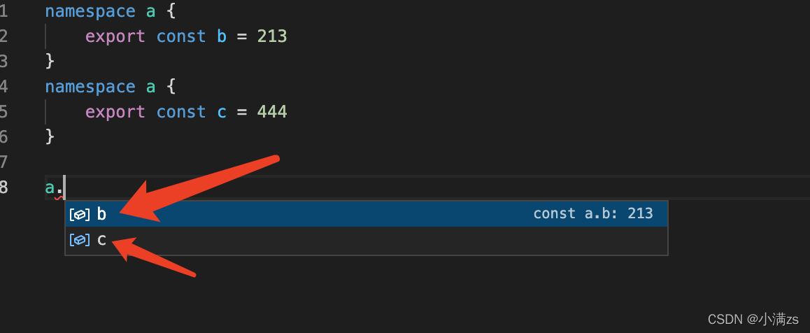
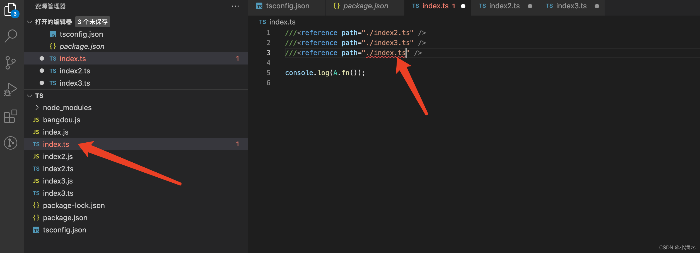

# TypeScript

## 

## 1、基础类型

tsc -w 编译ts文件到js

```js
let str:string='小满'//string类型
let num:number=123//数字类型
let b1:boolean=true//bool类型

let infinityNumber:number =Infinity //无穷大
let decimal:number=6//十进制
let hex:number=0xf00d;//十六进制
let binary:number=0b1010;//二进制
let octal:number=0o744;//八进制

let n:null=null 
let b:undefined=undefined 

let v1:void =null// 严格类型下为的，strict的false，不报错，前提是你得执行tsc --init
let a:undefined =undefinded //严格类型下为的，strict的false，不报错，前提是你得执行tsc --init

//void！！
function myFn():void{
  return 123//报错
}
```

 

## 2、任意类型

类型排行：

1、Top Type 顶级类型 any unknown

2、Object

3、Number、String、Boolean

4、number、string、boolean

5、never


Unknow的注意点：

1、只能赋值给自身，或者是any类型

2、没有办法读任何属性，方法也不可以调用

3、更加安全，相对于any来说


## 3、obejct、Object、{}

Object：所有类型都可以

object：引用类型

{}：类似于第一个，但是不能对对象的自变量进行操作

```js
let a:Object =123//正确 所有的类型的集合

let a:object='123'//错误 原始类型
let b:object=123//错误 原始类型
let c:object=false//错误 原始类型

let d:object=[]//正确 引用类型
let e:obejct={}//正确 引用类型


let a:{}={name:1}//相当于new Object，但是不能做对象的自变量操作，如下操作
a.age=2

```


## 4、接口和对象类型

接口中注意的点：

1、如果接口重名了，它的字段会合并

```tsx
interface Axxsxs{
  name:string
  age:number
}

let a:Axxsxs={
  name:"小红",
  age:99
}
```

2、任意key

```tsx
interface Axxsxs{
  name:string
  age:number
  [propName:string]:any//类似键值对，[]中的为键，String类型，值为any类型，注意值，规定了什么类型，接口的类型就要全部统一为一个类型
}

let a:Axxsxs={
  name:"小红",
  age:99
}
```

3、接口的？和readonly

```tsx
interface Axxsxs{
  name:string
  age?:number
  readonly id:number
}
```

4、接口继承

```tsx
interface Axxsxs extends B{
  name:string
  age?:number
  readonly id:number
}
```

5、接口定义函数类型

```tsx
//接口
interface Fn{
  (name:string):number[]
}
//继承
const fn:Fn=funciton(name:string){
  return [1]
}
```


## 5、数组类型

arguments：arguments简单来说，就是存储函数中参数的一个局部变量（注意是非[箭头函数](https://so.csdn.net/so/search?q=箭头函数&spm=1001.2101.3001.7020)），参数按索引为属性名，如第一个参数属性名是0，第二个参数属性名是1，第三个参数熟悉名是3，如

```js
function a(){ 
    console.log(arguments[0])
    console.log(arguments[1])
    console.log(arguments[2])
    
}
 
a(1,2,3)
 
// 输出：
// 1
// 2
// 3

//但注意它是一个类数组对象，可以看到，arguments的 _proto_ 指向的是 object，所以虽然看起来跟数组很像，有索引，有length，但不是数组，只是一个类数组对象，所以本身就没有数组原型上的那一堆方法了。
//当然有时候计算需要，要转换成真实数组也可以直接用 Array.from()方法或者扩展运算符
const argsArrayFrom = Array.from(arguments);
const args = [...arguments];
```


数组：

```tsx
//数组普通类型：number[]、Array<boolean>	
let arr:number[]=[1,2,3]
let arr:Array<boolean>=[true,false]

//定义对象数组使用interface
interface X{
  name:string
  age?:number
}
let arr:X[]=[{name:"逍遥"},{name:"xiaoman",age:21}]

//二维数组
let arr:number[][] =[[1],[2],[3]]
let arr:Array<Array<number>=[[1],[2],[3]]

//大杂烩数组
let arr:any[]=[1,'1123',true,{}]

//具体使用
function a(...args:string[]){
  console.log(arguments)
  //如果先要拿到arguments这个伪数组的数据，怎么办呢，
  //如下操作肯定报错
  let a:any[]=arguments
  //下面操作正确
  let a:IArguments=arguments.callee
}
a('1','2')

//IArguments的原理
interface X{
  name:string
  age?:number
  [index:number]:any
}
```


## 6、函数扩展

 1、函数定义类型和返回值 | 箭头函数定义类型和返回值

```tsx
function add(a:number,b:number):number{
  return a+b
}
```

2、函数默认的参数 | 函数可选参数

```tsx
//函数默认的参数
function add(a:number=10,b:number=20):number{
  return a+b
}
//函数可选参数
function add(a?:number,b?:number):number{
  return a+b
}
```

3、参数是一个对象如何定义

```tsx
interface User{
  name:string
  age:number
}

function add(user:User):User{
  return user
}
```

4、函数this类型

```tsx
interface Obj{
  user:number[]
  add:(this:Obj,num:number)=>void
}
//ts 可以定义this的类型 在js中无法使用 必须是第一个参数定义this类型
let obj:Obj={
  user:[1,2,3],
  add(this:Obj,num:number){
    this.user.push(num)
  }
}
obj.add(4)
```

5、函数重载

```tsx
let user:number[]=[1,2,3]

fucniton findNum(id:number):number[]
fucniton findNum():number[]
```


## 7、联合类型、类型断言、交叉类型

```tsx
//1、联合类型
let phone:number|string=12323
//0和1转化为布尔类型
let fn=funciton(type:number|boolean):boolean{
  return !!type
}

//2、交叉类型
interface Pople{
  name:string,
  age:number
}

interface Man{
  sex:number
}

const xiaoming =(man:Pople & Man):void =>{
  console.log(man)
}

//调用
xiaoming({name:'小满',sex:1,age:200})


//3、类型断言
let fn =funciton(num:number|string):void{
  console.log((num as string).length)
  //写法：1、num as string 2、<string>num
}

```


## 8、内置对象

ES内置对象：

**`Boolean`、Number、`string`、`RegExp`、`Date`、`Error`**

```tsx
let b: Boolean = new Boolean(1)
console.log(b)
let n: Number = new Number(true)
console.log(n)
let s: String = new String('哔哩哔哩关注小满zs')
console.log(s)
let d: Date = new Date()
console.log(d)
let r: RegExp = /^1/
console.log(r)
let e: Error = new Error("error!")
console.log(e)
```

DOM对象和BOM对象

**`Document`、`HTMLElement`、`Event`、`NodeList` 等**

```js
let body: HTMLElement = document.body;
let allDiv: NodeList = document.querySelectorAll('div');
//读取div 这种需要类型断言 或者加个判断应为读不到返回null
let div:HTMLElement = document.querySelector('div') as HTMLDivElement
document.addEventListener('click', function (e: MouseEvent) {
    
});
//dom元素的映射表
interface HTMLElementTagNameMap {
    "a": HTMLAnchorElement;
    "abbr": HTMLElement;
    "address": HTMLElement;
    "applet": HTMLAppletElement;
    "area": HTMLAreaElement;
    "article": HTMLElement;
    "aside": HTMLElement;
    "audio": HTMLAudioElement;
    "b": HTMLElement;
    "base": HTMLBaseElement;
    "bdi": HTMLElement;
    "bdo": HTMLElement;
    "blockquote": HTMLQuoteElement;
    "body": HTMLBodyElement;
    "br": HTMLBRElement;
    "button": HTMLButtonElement;
    "canvas": HTMLCanvasElement;
    "caption": HTMLTableCaptionElement;
    "cite": HTMLElement;
    "code": HTMLElement;
    "col": HTMLTableColElement;
    "colgroup": HTMLTableColElement;
    "data": HTMLDataElement;
    "datalist": HTMLDataListElement;
    "dd": HTMLElement;
    "del": HTMLModElement;
    "details": HTMLDetailsElement;
    "dfn": HTMLElement;
    "dialog": HTMLDialogElement;
    "dir": HTMLDirectoryElement;
    "div": HTMLDivElement;
    "dl": HTMLDListElement;
    "dt": HTMLElement;
    "em": HTMLElement;
    "embed": HTMLEmbedElement;
    "fieldset": HTMLFieldSetElement;
    "figcaption": HTMLElement;
    "figure": HTMLElement;
    "font": HTMLFontElement;
    "footer": HTMLElement;
    "form": HTMLFormElement;
    "frame": HTMLFrameElement;
    "frameset": HTMLFrameSetElement;
    "h1": HTMLHeadingElement;
    "h2": HTMLHeadingElement;
    "h3": HTMLHeadingElement;
    "h4": HTMLHeadingElement;
    "h5": HTMLHeadingElement;
    "h6": HTMLHeadingElement;
    "head": HTMLHeadElement;
    "header": HTMLElement;
    "hgroup": HTMLElement;
    "hr": HTMLHRElement;
    "html": HTMLHtmlElement;
    "i": HTMLElement;
    "iframe": HTMLIFrameElement;
    "img": HTMLImageElement;
    "input": HTMLInputElement;
    "ins": HTMLModElement;
    "kbd": HTMLElement;
    "label": HTMLLabelElement;
    "legend": HTMLLegendElement;
    "li": HTMLLIElement;
    "link": HTMLLinkElement;
    "main": HTMLElement;
    "map": HTMLMapElement;
    "mark": HTMLElement;
    "marquee": HTMLMarqueeElement;
    "menu": HTMLMenuElement;
    "meta": HTMLMetaElement;
    "meter": HTMLMeterElement;
    "nav": HTMLElement;
    "noscript": HTMLElement;
    "object": HTMLObjectElement;
    "ol": HTMLOListElement;
    "optgroup": HTMLOptGroupElement;
    "option": HTMLOptionElement;
    "output": HTMLOutputElement;
    "p": HTMLParagraphElement;
    "param": HTMLParamElement;
    "picture": HTMLPictureElement;
    "pre": HTMLPreElement;
    "progress": HTMLProgressElement;
    "q": HTMLQuoteElement;
    "rp": HTMLElement;
    "rt": HTMLElement;
    "ruby": HTMLElement;
    "s": HTMLElement;
    "samp": HTMLElement;
    "script": HTMLScriptElement;
    "section": HTMLElement;
    "select": HTMLSelectElement;
    "slot": HTMLSlotElement;
    "small": HTMLElement;
    "source": HTMLSourceElement;
    "span": HTMLSpanElement;
    "strong": HTMLElement;
    "style": HTMLStyleElement;
    "sub": HTMLElement;
    "summary": HTMLElement;
    "sup": HTMLElement;
    "table": HTMLTableElement;
    "tbody": HTMLTableSectionElement;
    "td": HTMLTableDataCellElement;
    "template": HTMLTemplateElement;
    "textarea": HTMLTextAreaElement;
    "tfoot": HTMLTableSectionElement;
    "th": HTMLTableHeaderCellElement;
    "thead": HTMLTableSectionElement;
    "time": HTMLTimeElement;
    "title": HTMLTitleElement;
    "tr": HTMLTableRowElement;
    "track": HTMLTrackElement;
    "u": HTMLElement;
    "ul": HTMLUListElement;
    "var": HTMLElement;
    "video": HTMLVideoElement;
    "wbr": HTMLElement;
}
```

类型定义：

```tsx
let local:Storage =localStorage
let lo:Location =Location
//如果我们不指定返回的类型TS是推断不出来返回的是什么类型
//promise设置返回值为number
let promise:Promise<number>=new Promise((r)=>r(1))

let cookie:string =document.cookie

```


## 9、Class对象

ES6提供了更接近传统语言的写法，引入了Class（类）这个概念，作为对象的模板。通过class关键字，可以定义类。基本上，ES6的class可以看作只是一个语法糖，它的绝大部分功能，ES5都可以做到，新的class写法只是让对象原型的写法更加清晰、更像面向对象编程的语法而已。上面的代码用ES6的“类”改写。

1、class的基本用法，继承和类型约束 implements

```tsx
interface Options{
  el:string | HTMLElement
}

interface VueCls{
  options:Options
  inti():void
}

class Vue implements VueCls{
 		options:Options
    constructor(options:Options){
      this.options=options
    }
  init():void{
    
  }
  
}
```

标准例子class对象

```tsx
class Person{
  name:string
  age:number
  constructor(name:string,age:number){
    this.name=name
    this.age=age
  }
  run(){
    
  }
}
```

注意的点：

1、你如果了定义了变量不用 也会报错 通常是给个默认值 或者 进行赋值

2、在TypeScript是不允许直接在constructor 定义变量的 需要在constructor上面先声明


2、修饰符

private：只能在内部使用

protected：给子类和内部去使用的

public：公开的


3、static 静态属性和静态方法

我们用static 定义的属性 不可以通过this 去访问 只能通过类名去调用

static 静态函数 同样也是不能通过this 去调用 也是通过类名去调用


4、interface 定义 类

```js
 
interface PersonClass {
    get(type: boolean): boolean
}
 
interface PersonClass2{
    set():void,
    asd:string
}
 
class A {
    name: string
    constructor() {
        this.name = "123"
    }
}
 
class Person extends A implements PersonClass,PersonClass2 {
    asd: string
    constructor() {
        super()
        this.asd = '123'
    }
    get(type:boolean) {
        return type
    }
    set () {
 
    }
}
```


5、抽象类

应用场景如果你写的类实例化之后毫无用处此时我可以把他定义为抽象类

或者你也可以把他作为一个基类-> 通过继承一个派生类去实现基类的一些方法


我们在A类定义了 getName 抽象方法但为实现

我们B类实现了A定义的抽象方法 如不实现就不报错 **我们定义的抽象方法必须在派生类实现**

```js
abstract class A {
   name: string
   constructor(name: string) {
      this.name = name;
   }
   print(): string {
      return this.name
   }
 
   abstract getName(): string
}
 
class B extends A {
   constructor() {
      super('小满')
   }
   getName(): string {
      return this.name
   }
}
 
let b = new B();
 
console.log(b.getName());
```

抽象类案例：

```tsx
//1. class 的基本用法 继承 和 类型约束
//2. class 的修饰符 readonly  private protected public
//3. super 原理
//4. 静态方法
//5. get set
interface Options {
    el: string | HTMLElement
}
 
interface VueCls {
    init(): void
    options: Options
}
 
interface Vnode {
    tag: string
    text?: string
    props?: {
        id?: number | string
        key?: number | string | object
    }
    children?: Vnode[]
}
 
class Dom {
    constructor() {
 
    }
 
    private createElement(el: string): HTMLElement {
        return document.createElement(el)
    }
 
    protected setText(el: Element, text: string | null) {
        el.textContent = text;
    }
 
    protected render(createElement: Vnode): HTMLElement {
        const el = this.createElement(createElement.tag)
        if (createElement.children && Array.isArray(createElement.children)) {
            createElement.children.forEach(item => {
                const child = this.render(item)
                this.setText(child, item.text ?? null)
                el.appendChild(child)
            })
        } else {
            this.setText(el, createElement.text ?? null)
        }
        return el;
    }
}
 
 
 
class Vue extends Dom implements VueCls {
    options: Options
    constructor(options: Options) {
        super()
        this.options = options;
        this.init()
    }
 
   static version () {
      return '1.0.0'
   }
 
   public init() {
        let app = typeof this.options.el == 'string' ? document.querySelector(this.options.el) : this.options.el;
        let data: Vnode = {
            tag: "div",
            props: {
                id: 1,
                key: 1
            },
            children: [
                {
                    tag: "div",
                    text: "子集1",
                },
                {
                    tag: "div",
                    text: "子集2"
                }
            ]
        }
        app?.appendChild(this.render(data))
        console.log(app);
 
        this.mount(app as Element)
    }
 
   public mount(app: Element) {
        document.body.append(app)
    }
}
 
 
const v = new Vue({
    el: "#app"
})
```


## 10、元组类型

使用场景： 如果需要一个固定大小的不同类型值的集合，我们需要使用元组。


元组介绍：元组就是数组的变种。元组（Tuple）是固定数量的不同类型的元素的组合。

元组与集合的不同之处在于，元组中的元素类型可以是不同的，而且数量固定。元组的好处在于可以把多个元素作为一个单元传递。如果一个方法需要返回多个值，可以把这多个值作为元组返回，而不需要创建额外的类来表示。

```tsx
let arr:[number,string] = [1,'string']
let arr2: readonly [number,boolean,string,undefined] = [1,true,'sring',undefined]

//当赋值或访问一个已知索引的元素时，会得到正确的类型：
let arr:[number,string] = [1,'string']
arr[0].length //error
arr[1].length //success
//数字是没有length 的

//元组类型还可以支持自定义名称和变为可选的
let a:[x:number,y?:boolean] = [1]
```


越界元素：

```tsx
let arr:[number,string] = [1,'string']
arr.push(true)//error
```

使用场景：

```tsx
let excel: [string, string, number, string][] = [
    ['title', 'name', 1, '123'],
    ['title', 'name', 1, '123'],
    ['title', 'name', 1, '123'],
    ['title', 'name', 1, '123'],
    ['title', 'name', 1, '123'],
]
```


## 11、枚举类型

在javaScript中是没有枚举的概念的TS帮我们定义了枚举这个类型

1、数字枚举

例如 红绿蓝 Red = 0 Green = 1 Blue= 2 分别代表红色0 绿色为1 蓝色为2

```ts
enum Types{
   Red = 0,
   Green = 1,
   BLue = 2
}
//默认就是从0开始的 可以不写值
```

增长枚举——只有数字枚举有

```ts
enum Types{
   Red = 1,
   Green,
   BLue
}
```

如上，我们定义了一个数字枚举， Red使用初始化为 `1`。 其余的成员会从 `1`开始自动增长。 换句话说， Type`.Red`的值为 `1`， `Green`为 `2`， `Blue`为 `3`。

2、字符串枚举

字符串枚举的概念很简单。 在一个字符串枚举里，每个成员都必须用字符串[字面量](https://so.csdn.net/so/search?q=字面量&spm=1001.2101.3001.7020)，或另外一个字符串枚举成员进行初始化。

```tsx
enum Types{
   Red = 'red',
   Green = 'green',
   BLue = 'blue'
}
```

由于字符串枚举没有自增长的行为，字符串枚举可以很好的序列化。 换句话说，如果你正在调试并且必须要读一个数字枚举的运行时的值，这个值通常是很难读的 - 它并不能表达有用的信息，字符串枚举允许你提供一个运行时有意义的并且可读的值，独立于枚举成员的名字。

3、异构枚举

枚举可以混合字符串和数字成员

```tsx
enum Types{
   No = "No",
   Yes = 1,
}
```

4、接口枚举

定义一个枚举Types 定义一个接口A 他有一个属性red 值为Types.yyds

```tsx
   enum Types {
      yyds,
      dddd
   }
   interface A {
      red:Types.yyds
   }
 
   let obj:A = {
      red:Types.yyds
   }
```

5、const枚举

let  和 var 都是不允许的声明只能使用const

大多数情况下，枚举是十分有效的方案。 然而在某些情况下需求很严格。 为了避免在额外生成的代码上的开销和额外的非直接的对枚举成员的访问，我们可以使用 const枚举。 常量枚举通过在枚举上使用 const修饰符来定义

const 声明的枚举会被编译成常量

普通声明的枚举编译完后是个对象

```tsx
const enum Types{
   No = "No",
   Yes = 1,
}
```

6、反向映射

它包含了正向映射（ `name` -> `value`）和反向映射（ `value` -> `name`）

 要注意的是 *不会*为字符串枚举成员生成反向映射。

```tsx
enum Enum {
   fall
}
let a = Enum.fall;
console.log(a); //0
let nameOfA = Enum[a]; 
console.log(nameOfA); //fall
```


## 12、类型推论

什么是类型推论——let str = "小满zs"

1.我声明了一个变量但是没有定义类型[TypeScript](https://so.csdn.net/so/search?q=TypeScript&spm=1001.2101.3001.7020) 会在没有明确的指定类型的时候推测出一个类型，这就是类型推论

2、如果你声明变量没有定义类型也没有赋值这时候TS会推断成any类型可以进行任何操作


类型别名：type关键字多用于复合类型

定义类型别名：

```tsx
type str = string
 
let s:str = "我是小满"
 
console.log(s);
```

定义函数别名：

```tsx
type str = () => string
 
let s: str = () => "我是小满"
 
console.log(s);
```

定义联合类型别名：

```tsx
type str = string | number

let s: str = 123
 
let s2: str = '123'
 
console.log(s,s2);
```

定义值的别名：

```tsx
type value = boolean | 0 | '213'
let s:value = true
//变量s的值  只能是上面value定义的值
```

type 和 interface 还是一些区别的 虽然都可以定义类型

1.interface可以继承  type 只能通过 & 交叉类型合并

2.type 可以定义 联合类型 和 可以使用一些操作符 interface不行

3.interface 遇到重名的会合并 type 不行


## 13、never类型

ts将使用 never 类型来表示不应该存在的状态(很抽象是不是)

```tsx
// 返回never的函数必须存在无法达到的终点
 
// 因为必定抛出异常，所以 error 将不会有返回值
function error(message: string): never {
    throw new Error(message);
}
 
// 因为存在死循环，所以 loop 将不会有返回值
function loop(): never {
    while (true) {
    }
}
```

never与void的差异

```ts
    //void类型只是没有返回值 但本身不会出错
    function Void():void {
        console.log();
    }
 
    //只会抛出异常没有返回值
    function Never():never {
    throw new Error('aaa')
    }
```

差异二：当我们鼠标移上去的时候会发现 只有void和number  never在联合类型中会被直接移除

```
type A = void | number | never
```


### never 类型的一个应用场景

```tsx
type A = '小满' | '大满' | '超大满' 
 
function isXiaoMan(value:A) {
   switch (value) {
       case "小满":
           break 
       case "大满":
          break 
       case "超大满":
          break 
       default:
          //是用于场景兜底逻辑
          const error:never = value;
          return error
   }
}
```

比如新来了一个同事他新增了一个篮球，我们必须手动找到所有 switch 代码并处理，否则将有可能引入 BUG 。

而且这将是一个“隐蔽型”的BUG，如果回归面不够广，很难发现此类BUG。

那 TS 有没有办法帮助我们在类型检查阶段发现这个问题呢？

```tsx
type A = '小满' | '大满' | '超大满' | "小小满"
 
function isXiaoMan(value:A) {
   switch (value) {
       case "小满":
           break 
       case "大满":
          break 
       case "超大满":
          break 
       default:
          //是用于场景兜底逻辑
          const error:never = value;
          return error
   }
}
```

由于任何类型都不能赋值给 `never` 类型的变量，所以当存在进入 `default` 分支的可能性时，TS的类型检查会及时帮我们发现这个问题


## 14、symbol类型

 `symbol`类型的值是通过`Symbol`构造函数创建的。

可以传递参做为唯一标识 只支持 string 和 [number类型](https://so.csdn.net/so/search?q=number类型&spm=1001.2101.3001.7020)的参数

```tsx
//1、介绍
let a1:symbol =Symbol(1)//唯一的
let a2:symbol =Symbol(1)//唯一的
//for symbol for全局symbol有没有注册过这个key，如果有直接拿来用，没有的话他就去创建一个

//2.用作对象属性的键
let sym = Symbol();
let obj = {
    [sym]: "value"
};
console.log(obj[sym]); // "value"

//3.使用symbol定义的属性，是不能通过如下方式遍历拿到的
const symbol1 = Symbol('666')
const symbol2 = Symbol('777')
const obj1= {
   [symbol1]: '小满',
   [symbol2]: '二蛋',
   age: 19,
   sex: '女'
}
// 1 for in 遍历
for (const key in obj1) {
   // 注意在console看key,是不是没有遍历到symbol1
   console.log(key)// name sex
}
// 2 Object.keys 遍历
Object.keys(obj1)
console.log(Object.keys(obj1))//['name','sex']
// 3 getOwnPropertyNames
console.log(Object.getOwnPropertyNames(obj1))//['name','sex']
// 4 JSON.stringfy
console.log(JSON.stringify(obj1))


//如何拿到
// 1 拿到具体的symbol 属性,对象中有几个就会拿到几个
Object.getOwnPropertySymbols(obj1)
console.log(Object.getOwnPropertySymbols(obj1))//[Symbol('666'),Symbol('777')]
// 2 es6 的 Reflect 拿到对象的所有属性
Reflect.ownKeys(obj1)
console.log(Reflect.ownKeys(obj1))
```


### 14.1 迭代器和生成器for of

支持遍历大部分类型迭代器 arr nodeList argumetns set map 等

```tsx
var arr = [1,2,3,4];
let iterator = arr[Symbol.iterator]();
 
console.log(iterator.next());  //{ value: 1, done: false }
console.log(iterator.next());  //{ value: 2, done: false }
console.log(iterator.next());  //{ value: 3, done: false }
console.log(iterator.next());  //{ value: 4, done: false }
console.log(iterator.next());  //{ value: undefined, done: true }
```

测试用例（迭代器）

```tsx
interface Item {
    age: number,
    name: string
}
 
const array: Array<Item> = [{ age: 123, name: "1" }, { age: 123, name: "2" }, { age: 123, name: "3" }]
 
type mapTypes = string | number
const map:Map<mapTypes,mapTypes> = new Map()
 
map.set('1','王爷')
map.set('2','陆北')
 
const obj = {
    aaa:123,
    bbb:456
}
 
let set:Set<number> = new Set([1,2,3,4,5,6])
// let it:Iterator<Item> = array[Symbol.iterator]()
const gen = (erg:any): void => {
    let it: Iterator<any> = erg[Symbol.iterator]()
    let next:any= { done: false }
    while (!next.done) {
        next =  it.next()
        if (!next.done) {
            console.log(next.value)
        }
    }
}
gen(array)
```


我们平时开发中不会手动调用iterator 应为 他是有[语法糖](https://so.csdn.net/so/search?q=语法糖&spm=1001.2101.3001.7020)的就是for of 记住 for of 是不能循环对象的应为对象没有 iterator 

```tsx
for (let value of map) {
    console.log(value)
}
//数组解构的原理其实也是调用迭代器的
var [a,b,c] = [1,2,3]
 
var x = [...xxxx]
```

 那我们可以自己实现一个迭代器让对象支持for of

```tsx
 
const obj = {
    max: 5,
    current: 0,
    [Symbol.iterator]() {
        return {
            max: this.max,
            current: this.current,
            next() {
                if (this.current == this.max) {
                    return {
                        value: undefined,
                        done: true
                    }
                } else {
                    return {
                        value: this.current++,
                        done: false
                    }
                }
            }
        }
    }
}
console.log([...obj])
 
for (let val of obj) {
   console.log(val);
   
}
```

Symbol.hasInstance
方法，会被instanceof运算符调用。构造器对象用来识别一个对象是否是其实例。

Symbol.isConcatSpreadable
布尔值，表示当在一个对象上调用Array.prototype.concat时，这个对象的数组元素是否可展开。

Symbol.iterator
方法，被for-of语句调用。返回对象的默认迭代器。

Symbol.match
方法，被String.prototype.match调用。正则表达式用来匹配字符串。

Symbol.replace
方法，被String.prototype.replace调用。正则表达式用来替换字符串中匹配的子串。

Symbol.search
方法，被String.prototype.search调用。正则表达式返回被匹配部分在字符串中的索引。

Symbol.species
函数值，为一个构造函数。用来创建派生对象。

Symbol.split
方法，被String.prototype.split调用。正则表达式来用分割字符串。

Symbol.toPrimitive
方法，被ToPrimitive抽象操作调用。把对象转换为相应的原始值。

Symbol.toStringTag
方法，被内置方法Object.prototype.toString调用。返回创建对象时默认的字符串描述。

Symbol.unscopables
对象，它自己拥有的属性会被with作用域排除在外。

## 15、泛型

[泛型](https://so.csdn.net/so/search?q=泛型&spm=1001.2101.3001.7020)在TypeScript 是很重要的东西 例如vue3 是用ts编写的 里面用到了非常多的泛型

### 15.1 函数泛型

我写了两个函数一个是数字类型的函数，另一个是字符串类型的函数,其实就是类型不同，

实现的功能是一样的，这时候我们就可以使用泛型来优化

```tsx
function num (a:number,b:number) : Array<number> {
    return [a ,b];
}
num(1,2)
function str (a:string,b:string) : Array<string> {
    return [a ,b];
}
str('独孤','求败')
```

泛型优化

语法为函数名字后面跟一个<参数名> 参数名可以随便写 例如我这儿写了T

当我们使用这个函数的时候把参数的类型传进去就可以了 （也就是动态类型）

```tsx
function Add<T>(a: T, b: T): Array<T>  {
    return [a,b]
}
 
Add<number>(1,2)
Add<string>('1','2')
```

我们也可以使用不同的泛型参数名，只要在数量上和使用方式上能对应上就可以。

```tsx
function Sub<T,U>(a:T,b:U):Array<T|U> {
    const params:Array<T|U> = [a,b]
    return params
}
 
 
Sub<Boolean,number>(false,1)
```

### 15.2 定义泛型接口

声明接口的时候 在名字后面加一个<参数>

 使用的时候传递类型

```tsx
interface MyInter<T> {
   (arg: T): T
}
 
function fn<T>(arg: T): T {
   return arg
}
 
let result: MyInter<number> = fn
 
result(123)
```

**对象字面量泛型**

```tsx
let foo: { <T>(arg: T): T }
 
foo = function <T>(arg:T):T {
   return arg
}
 
foo(123)
```

**泛型约束**

我们期望在一个泛型的变量上面，获取其`length`参数，但是，有的数据类型是没有`length`属性的

```tsx
function getLegnth<T>(arg:T) {
  return arg.length
}
```

这时候我们就可以使用泛型约束

于是，我们就得对使用的泛型进行约束，我们约束其为具有`length`属性的类型，这里我们会用到`interface`,代码如下

```tsx
interface Len {
   length:number
}
 
function getLegnth<T extends Len>(arg:T) {
  return arg.length
}
//有length的数组，字符等
getLegnth<string>('123')


//简单点的约束
function dd<T extends number>(age,b){
  return a+b
}
```

泛型案例：

```tsx
const axios ={
  get<T>(url:string):Promise<T>{
    return new Promise((resolve,reject)=>{
      let xhr:XMLHttpRequest =new XMLHttpRequest()
      xhr.open('get',url)
      xhr.onreadystatechange=()=>{
        if(xhr.readyState==4&&xhr.status==200){
          resolve(json.parse(xhr.responseText))
        }
      }
      xhr.send(null)
    })
  }
}

interface Data{
  message:string
  code:number
}

axios.get<Data>('./data.json').then(res=>{
  console.log(res);//这样就可以使用T自动来推断
})
```

**使用keyof约束对象**

其中使用了TS泛型和泛型约束。首先定义了T类型并使用extends关键字继承object类型的子类型，然后使用keyof操作符获取T类型的所有键，它的返回 类型是联合 类型，最后利用extends关键字约束 K类型必须为keyof T联合类型的子类型

```tsx
//只是看看
let obj ={
  name:"xiaoman"
  sex:"女"
}
type Key =keyof typeof obj
function ob<T extends object,K extends keyof T>(obj:T,key:K){
  return obj[key]
}

//新写法
function prop<T, K extends keyof T>(obj: T, key: K) {
   return obj[key]
}

let o = { a: 1, b: 2, c: 3 }

prop(o, 'a') 
prop(o, 'd') //此时就会报错发现找不到


//demo
interface Data{
  name:string
  age:number
  sex:string
}
type Options<T extends object>={
  readonly [Key in keyof T]:T[Key]
}
type B=Options<Data>
```

**泛型类**

声明方法跟函数类似名称后面定义<类型>

使用的时候确定类型new Sub<number>()

```tsx
class Sub<T>{
   attr: T[] = [];
   add (a:T):T[] {
      return [a]
   }
}
 
let s = new Sub<number>()
s.attr = [1,2,3]
s.add(123)
 
let str = new Sub<string>()
str.attr = ['1','2','3']
str.add('123')
```


## 16、tsconfig.json配置文件

配置详解

```tsx
"compilerOptions": {
  "incremental": true, // TS编译器在第一次编译之后会生成一个存储编译信息的文件，第二次编译会在第一次的基础上进行增量编译，可以提高编译的速度
  "tsBuildInfoFile": "./buildFile", // 增量编译文件的存储位置
  "diagnostics": true, // 打印诊断信息 
  "target": "ES5", // 目标语言的版本
  "module": "CommonJS", // 生成代码的模板标准
  "outFile": "./app.js", // 将多个相互依赖的文件生成一个文件，可以用在AMD模块中，即开启时应设置"module": "AMD",
  "lib": ["DOM", "ES2015", "ScriptHost", "ES2019.Array"], // TS需要引用的库，即声明文件，es5 默认引用dom、es5、scripthost,如需要使用es的高级版本特性，通常都需要配置，如es8的数组新特性需要引入"ES2019.Array",
  "allowJS": true, // 允许编译器编译JS，JSX文件
  "checkJs": true, // 允许在JS文件中报错，通常与allowJS一起使用
  "outDir": "./dist", // 指定输出目录
  "rootDir": "./", // 指定输出文件目录(用于输出)，用于控制输出目录结构
  "declaration": true, // 生成声明文件，开启后会自动生成声明文件
  "declarationDir": "./file", // 指定生成声明文件存放目录
  "emitDeclarationOnly": true, // 只生成声明文件，而不会生成js文件
  "sourceMap": true, // 生成目标文件的sourceMap文件
  "inlineSourceMap": true, // 生成目标文件的inline SourceMap，inline SourceMap会包含在生成的js文件中
  "declarationMap": true, // 为声明文件生成sourceMap
  "typeRoots": [], // 声明文件目录，默认时node_modules/@types
  "types": [], // 加载的声明文件包
  "removeComments":true, // 删除注释 
  "noEmit": true, // 不输出文件,即编译后不会生成任何js文件
  "noEmitOnError": true, // 发送错误时不输出任何文件
  "noEmitHelpers": true, // 不生成helper函数，减小体积，需要额外安装，常配合importHelpers一起使用
  "importHelpers": true, // 通过tslib引入helper函数，文件必须是模块
  "downlevelIteration": true, // 降级遍历器实现，如果目标源是es3/5，那么遍历器会有降级的实现
  "strict": true, // 开启所有严格的类型检查
  "alwaysStrict": true, // 在代码中注入'use strict'
  "noImplicitAny": true, // 不允许隐式的any类型
  "strictNullChecks": true, // 不允许把null、undefined赋值给其他类型的变量
  "strictFunctionTypes": true, // 不允许函数参数双向协变
  "strictPropertyInitialization": true, // 类的实例属性必须初始化
  "strictBindCallApply": true, // 严格的bind/call/apply检查
  "noImplicitThis": true, // 不允许this有隐式的any类型
  "noUnusedLocals": true, // 检查只声明、未使用的局部变量(只提示不报错)
  "noUnusedParameters": true, // 检查未使用的函数参数(只提示不报错)
  "noFallthroughCasesInSwitch": true, // 防止switch语句贯穿(即如果没有break语句后面不会执行)
  "noImplicitReturns": true, //每个分支都会有返回值
  "esModuleInterop": true, // 允许export=导出，由import from 导入
  "allowUmdGlobalAccess": true, // 允许在模块中全局变量的方式访问umd模块
  "moduleResolution": "node", // 模块解析策略，ts默认用node的解析策略，即相对的方式导入
  "baseUrl": "./", // 解析非相对模块的基地址，默认是当前目录
  "paths": { // 路径映射，相对于baseUrl
    // 如使用jq时不想使用默认版本，而需要手动指定版本，可进行如下配置
    "jquery": ["node_modules/jquery/dist/jquery.min.js"]
  },
  "rootDirs": ["src","out"], // 将多个目录放在一个虚拟目录下，用于运行时，即编译后引入文件的位置可能发生变化，这也设置可以虚拟src和out在同一个目录下，不用再去改变路径也不会报错
  "listEmittedFiles": true, // 打印输出文件
  "listFiles": true// 打印编译的文件(包括引用的声明文件)
}
 
// 指定一个匹配列表（属于自动指定该路径下的所有ts相关文件）
"include": [
   "src/**/*"
],
// 指定一个排除列表（include的反向操作）
 "exclude": [
   "demo.ts"
],
// 指定哪些文件使用该配置（属于手动一个个指定文件）
 "files": [
   "demo.ts"
]
```


## 17、namespace命名空间

我们在工作中无法避免全局变量造成的污染，[TypeScript](https://so.csdn.net/so/search?q=TypeScript&spm=1001.2101.3001.7020)提供了namespace 避免这个问题出现

- 内部模块，主要用于组织代码，避免命名冲突。
- 命名空间内的类默认私有
- 通过 `export` 暴露
- 通过 `namespace` 关键字定义

TypeScript与ECMAScript 2015一样，任何包含顶级import或者export的文件都被当成一个模块。相反地，如果一个文件不带有顶级的import或者export声明，那么它的内容被视为全局可见的（因此对模块也是可见的）
ok，让我们看一个小例子

命名空间中通过export将想要暴露的部分导出

如果不用export 导出是无法读取其值的

```tsx
namespace a {
    export const Time: number = 1000
    export const fn = <T>(arg: T): T => {
        return arg
    }
    fn(Time)
}
 
 
namespace b {
     export const Time: number = 1000
     export const fn = <T>(arg: T): T => {
        return arg
    }
    fn(Time)
}
 
a.Time
b.Time
```

嵌套命名空间

```tsx
namespace a {
    export namespace b {
        export class Vue {
            parameters: string
            constructor(parameters: string) {
                this.parameters = parameters
            }
        }
    }
}
 
let v = a.b.Vue
 
new v('1')
```

抽离命名空间

```tsx
//a.ts
export namespace V {
    export const a = 1
}
//b.ts
import {V} from '../observer/index'
console.log(V);
 //{a:1}
```

简化命名空间

```tsx
namespace A  {
    export namespace B {
        export const C = 1
    }
}
 
import X = A.B.C
 
console.log(X);
```

合并命名空间

重名的命名空间会合并



## 19、三斜线指令

三斜线指令是包含单个XML标签的单行注释。 注释的内容会做为编译器指令使用。

三斜线指令仅可放在包含它的文件的最顶端。 一个三斜线指令的前面只能出现单行或多行注释，这包括其它的三斜线指令。 如果它们出现在一个语句或声明之后，那么它们会被当做普通的单行注释，并且不具有特殊的涵义。

/// <reference path="..." />指令是三斜线指令中最常见的一种。 它用于声明文件间的 依赖。

三斜线引用告诉编译器在编译过程中要引入的额外的文件。

你也可以把它理解能import，它可以告诉编译器在编译过程中要引入的额外的文件

```tsx
//例如a.ts
namespace A {
    export const fn = () => 'a'
}
//b.ts
namespace A {
    export const fn2 = () => 'b'
}
//index.ts
//引入之后直接可以使用变量A
///<reference path="./index2.ts" />
///<reference path="./index3.ts" />
console.log(A);
```

声明文件引入

例如，把 /// <reference types="node" />引入到声明文件，表明这个文件使用了 @types/node/index.d.ts里面声明的名字； 并且，这个包需要在编译阶段与声明文件一起被包含进来。

仅当在你需要写一个d.ts文件时才使用这个指令。
///<reference types="node" />

注意事项：

如果你在配置文件 配置了noResolve 或者自身调用自身文件会报错



## 20、声明文件

Declare 声明文件

当使用第三方库时，我们需要引用它的声明文件，才能获得对应的代码补全、接口提示等功能。

```tsx
declare var 声明全局变量
declare function 声明全局方法
declare class 声明全局类
declare enum 声明全局枚举类型
declare namespace 声明（含有子属性的）全局对象
interface 和 type 声明全局类型
/// <reference /> 三斜线指令
```

1、第一种引入声明文件的方式是：

 发现express 报错了

让我们去下载他的声明文件

npm install @types/node -D

那为什么axios 没有报错

我们可以去node_modules 下面去找axios 的package json 发现axios已经指定了声明文件 所以没有报错可以直接用通过语法declare 暴露我们声明的axios 对象

如果有一些第三方包确实没有声明文件我们可以自己去定义

名称.d.ts 创建一个文件去声明

2、手写声明文件：

```tsx
//index.ts
import express from 'express'
 
 
const app = express()
 
const router = express.Router()
 
app.use('/api', router)
 
router.get('/list', (req, res) => {
    res.json({
        code: 200
    })
})
 
app.listen(9001,()=>{
    console.log(9001)
})

//express.d.ts
declare module 'express' {
    interface Router {
        get(path: string, cb: (req: any, res: any) => void): void
    }
    interface App {
 
        use(path: string, router: any): void
        listen(port: number, cb?: () => void): void
    }
    interface Express {
        (): App
        Router(): Router
 
    }
    const express: Express
    export default express
}
```

TS声明包收录到这个网站中：https://www.npmjs.com/~types?activeTab=packages

## 21、Mixins混入

[TypeScript](https://so.csdn.net/so/search?q=TypeScript&spm=1001.2101.3001.7020) 混入 Mixins 其实vue也有mixins这个东西 你可以把他看作为合并

1、对象混入

可以使用es6的Object.assign 合并多个对象

此时 people 会被推断成一个交差类型 Name & Age & sex;

```tsx
interface Name {
    name: string
}
interface Age {
    age: number
}
interface Sex {
    sex: number
}
 
let people1: Name = { name: "小满" }
let people2: Age = { age: 20 }
let people3: Sex = { sex: 1 }
 
const people = Object.assign(people1,people2,people3)
```

下面创建一个类，结合了这两个mixins

首先应该注意到的是，没使用extends而是使用implements。 把类当成了接口

我们可以这么做来达到目的，为将要mixin进来的属性方法创建出占位属性。 这告诉编译器这些成员在运行时是可用的。 这样就能使用mixin带来的便利，虽说需要提前定义一些占位属性

```tsx
class C implements A,B{
    type:boolean
    changeType:()=>void;
    name: string;
    getName:()=> string
}
```

最后，创建这个帮助函数，帮我们做混入操作。 它会遍历mixins上的所有属性，并复制到目标上去，把之前的占位属性替换成真正的实现代码

Object.getOwnPropertyNames()可以获取对象自身的属性，除去他继承来的属性，
对它所有的属性遍历，它是一个数组，遍历一下它所有的属性名

```tsx
Mixins(C, [A, B])
function Mixins(curCls: any, itemCls: any[]) {
    itemCls.forEach(item => {
        Object.getOwnPropertyNames(item.prototype).forEach(name => {
            curCls.prototype[name] = item.prototype[name]
        })
    })
}
```


